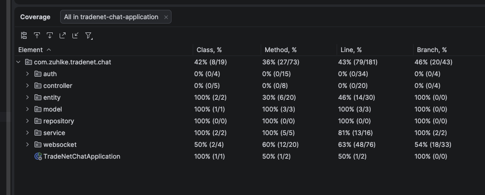

# Realtime Chat MVP

A real-time 1:1 messaging web app: Spring Boot backend, Thymeleaf + vanilla JS
frontend, H2 for persistence. Connection lifecycle, message routing, and delivery
is handwritten on top of Spring's low-level `WebSocketHandler` API — no messaging
framework or broker does the core feature.

## Run it

```bash
docker compose up --build
```

Then open two browser windows at **http://localhost:8080/login**.

Four demo accounts (alice,bob,carol,dave) are seeded on first startup, all sharing one password: password123


Log in as two different users in the two private windows, pick each other from the sidebar,
and send messages — delivery is live, no page refresh needed.

Override the demo password or exposed port via environment variables in
`docker-compose.yml` (`DEMO_PASSWORD`, and change the `8080:8080` port mapping).

Data (users + message history) persists on a named Docker volume, so
`docker compose down` followed by `docker compose up` keeps everything; only
`docker compose down -v` wipes it.

## Run it locally (without Docker)

Requires Java 21 and Maven (or use the bundled wrapper):

```bash
./mvnw spring-boot:run
```

## Architecture

```
Browser (Thymeleaf + vanilla JS)
   |  HTTP: /login /logout /chat /api/conversations/{id}/messages
   |  WS:   /ws/chat  (raw WebSocket, hand-rolled JSON envelope protocol)
   v
Spring Boot
   auth/       - Spring Security, User entity, BCrypt, demo-user seeding
   websocket/  - ConnectionRegistry, ChatWebSocketHandler, handshake auth
   entity/     - Message, User JPA entities
   repository/ - Spring Data JPA repositories
   service/    - MessageService (persist-before-push, idempotent sends)
   controller/ - Thymeleaf page controllers, REST history endpoint
   model/      - WsEnvelope, the single WebSocket message shape
   v
H2 (file-mode, on a Docker volume)
```

Key design decisions (persist-before-push ordering, per-session send locking,
idempotent send handling via a unique `(sender_id, client_msg_id)` constraint) are
documented as inline comments at the relevant code.

## Tests

```bash
./mvnw test
```

Test Coverage is as below



## Limitations

- Reconnect backfill (a message sent while offline is only picked up on next
  page load, not retroactively pushed)
- Optimistic client-side rendering (the sender's own message renders on ack,
  not immediately on submit)
- Rate limiting / abuse prevention on the WebSocket
- Multi-instance horizontal scaling (the connection registry is in-process; a
  Redis pub/sub layer is the natural next step, not built here)
- No Read receipts & no notifications when a new message comes in user has to select the other users and check for messages
